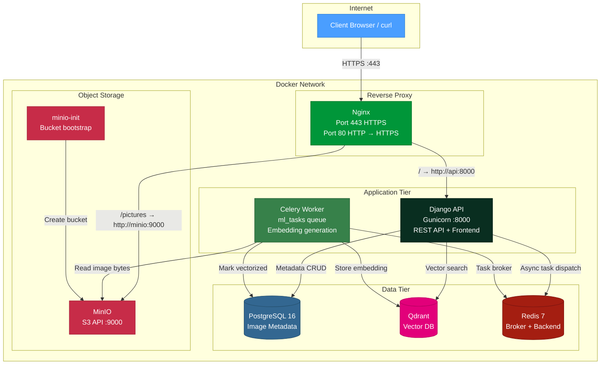
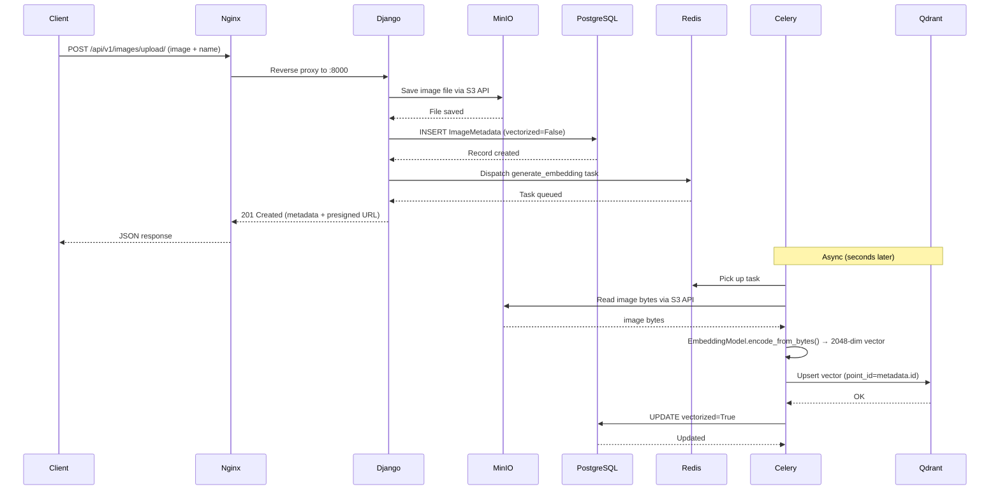
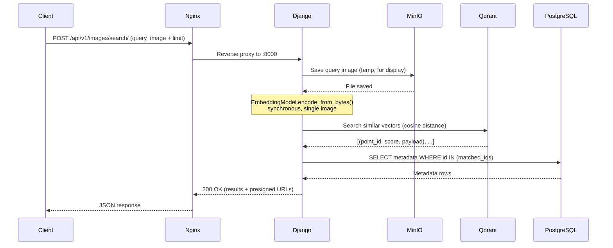

# System Architecture

## 1. System Overview

**Image Vector Search and Storage** is a fully containerized web application that enables users to upload images and search for visually similar images using **content-based image retrieval (CBIR)**. Each image is represented by a **2048-dimensional feature vector** extracted from a pre-trained **ResNet50** neural network. These vectors are stored in **Qdrant** (a vector database), enabling fast similarity search via cosine distance.

The system follows a **microservices-like architecture** orchestrated with Docker Compose, consisting of 8 containers working together:

| Container          | Purpose                                                |
| ------------------ | ------------------------------------------------------ |
| `nginx-proxy`      | SSL termination, reverse proxy to Django & MinIO       |
| `postgres`         | Image metadata database (PostgreSQL 16)                |
| `redis`            | Celery message broker (db 0) + result backend (db 1)   |
| `qdrant`           | Vector database for image embeddings                   |
| `minio`            | S3-compatible object storage for images                |
| `minio-init`       | One-shot bootstrap — creates the S3 bucket             |
| `django-api`       | Django REST API + frontend (Gunicorn, 4 workers)       |
| `celery-worker`    | Celery worker for async ML embedding tasks             |

---

## 2. Container Architecture



---

## 3. Request Flows

### 3.1 Image Upload Flow



### 3.2 Image Search Flow



> **Note:** Search generates the query embedding **synchronously** because it processes a single image — the overhead of dispatching a Celery task for one image would add latency without benefit. Upload, on the other hand, is **asynchronous** because multiple uploads may arrive concurrently and the ML inference is CPU-intensive.

---

## 4. Django Component Map

```
config/                    # Django project configuration
├── settings.py            # DB, storage, Celery, DRF, Qdrant config
├── urls.py                # Root URL routing
├── wsgi.py                # Gunicorn WSGI entrypoint
└── asgi.py                # ASGI entrypoint (unused)

images/                    # Core Django app — image CRUD + API
├── models.py              # ImageMetadata model (UUID, name, image, ...)
├── api/
│   ├── v1/
│   │   ├── urls.py        # /api/v1/images/, /upload/, /search/, /<uuid>/
│   │   └── views.py       # ImageViewSet (list, retrieve, upload, search)
│   ├── serializers.py     # ImageMetadata, ImageUpload, ImageSearch, SearchResult
│   └── permissions.py     # IsAdminUserForDocs (Swagger protection)
├── admin.py               # Django admin registration
├── tests.py               # Unit tests
└── migrations/            # DB migrations

embeddings/                # Django app — ML + vector DB integration
├── embed_model.py         # EmbeddingModel (ResNet50, 2048-dim, cached)
├── qdrant_service.py      # QdrantService (ensure_collection, upsert, search)
├── tasks.py               # Celery shared_task: generate_embedding
└── apps.py                # AppConfig

frontend/                  # Django app — web UI
├── urls.py                # Single route: /
├── views.py               # index() → render frontend/index.html
└── templates/frontend/    # HTML templates

storage/                   # Custom storage backend
├── custom_s3.py           # ExternalS3Storage (presigned URL host substitution)
└── boto3.py               # Module-level boto3 session/client

worker/                    # Celery application configuration
├── __init__.py            # Makes Celery auto-discoverable
└── celery.py              # Celery app instance + autodiscover
```

---

## 5. Nginx Reverse Proxy

| Feature              | Implementation                                       |
| -------------------- | ---------------------------------------------------- |
| **SSL Termination**  | Self-signed certs (dev) or real certs (prod)         |
| **HTTP→HTTPS**       | Hard redirect (301) for both Django & MinIO domains  |
| **Security Headers** | HSTS, X-Frame-Options, X-Content-Type-Options        |
| **Static Files**     | Served directly by Nginx (`/static/` → `/app/staticfiles/`) |
| **Proxy to Django**  | `proxy_pass http://api:8000`                         |
| **Proxy to MinIO**   | `proxy_pass http://minio:9000` (S3 API only, no Console) |

Nginx serves two virtual hosts on port 443:

- **`${NGINX_SERVER_NAME}`** (default: `localhost`) → Django API + frontend
- **`${MINIO_SERVER_NAME}`** (default: `minio.localhost`) → MinIO S3 API

SSL certificates are generated at container startup by `entrypoint.sh` using OpenSSL, with a SAN covering both hostnames.

---

## 6. Data Model

### 6.1 PostgreSQL — `images_imagemetadata`

| Column       | Type              | Notes                              |
| ------------ | ----------------- | ---------------------------------- |
| `id`         | `UUID` (PK)       | Generated via `uuid7()` (time-sortable) |
| `name`       | `VARCHAR(255)`    | User-friendly image name           |
| `image`      | `FileField`       | Stored in MinIO via ExternalS3Storage |
| `uploaded_at`| `DateTime`        | Auto-set on creation               |
| `file_size`  | `BIGINT`          | Nullable, set on upload             |
| `vectorized` | `BOOLEAN`         | `False` initially, `True` after embedding |

### 6.2 Qdrant — Collection: `image_assets_resnet50_2048`

| Property        | Value                                |
| --------------- | ------------------------------------ |
| **Vector Size** | 2048 (ResNet50 feature dimension)    |
| **Distance**    | Cosine                               |
| **Point ID**    | UUID string (matching PostgreSQL PK) |
| **Payload**     | `{ name, file_size, uploaded_at }`   |

### 6.3 MinIO — Bucket: `pictures`

```
pictures/
├── images/                   # Uploaded images
│   └── <uuid>_<filename>     # Named by Django ORM + FileField
└── images/search_queries/    # Temp query images (not persisted in DB)
    └── <uuid>_<filename>
```

> **Note:** The `minio-init` container creates the bucket and sets it to **public** on startup. Despite the `anonymous public` policy, individual object access is still gated by **presigned URLs** generated by the Django storage backend.

---

## 7. Custom S3 Storage Design

### Problem

MinIO runs inside the Docker network at `http://minio:9000`. External clients cannot reach this address. Nginx reverse-proxies MinIO at `https://minio.localhost`. Django's `S3Boto3Storage` generates presigned URLs containing the **internal** endpoint by default.

### Solution: `ExternalS3Storage`

```python
class ExternalS3Storage(S3Boto3Storage):
    def url(self, name, parameters=None, expire=None, http_method=None):
        internal_url = super().url(name, parameters, expire, http_method)

        external_endpoint = getattr(settings, "S3_EXTERNAL_ENDPOINT_URL", None)
        if not external_endpoint:
            return internal_url

        # Replace internal authority (e.g., http://minio:9000)
        # with external authority (e.g., https://minio.localhost)
        internal_parsed = urlparse(self.endpoint_url)
        external_parsed = urlparse(external_endpoint)

        internal_authority = f"{internal_parsed.scheme}://{internal_parsed.netloc}"
        external_authority = f"{external_parsed.scheme}://{external_parsed.netloc}"

        return internal_url.replace(internal_authority, external_authority, 1)
```

**Key design decision:** Instead of temporarily mutating `self.endpoint_url` (which is shared state across all requests/threads in a Gunicorn worker — causing race conditions), the URL is generated with the internal endpoint and then a **string replacement** of the host is performed. This is safe because:
1. `self.endpoint_url` is never modified
2. The internal authority appears exactly once, at the start of the URL
3. The operation is pure string manipulation with no side effects

---

## 8. Directory Structure

```
PRP/
├── .dockerignore
├── .env.example
├── .gitignore
├── ARCHITECTURE.md
├── docker-compose.yml        # Service orchestration (8 containers)
├── Dockerfile                 # Multi-stage Python build (uv → runtime)
├── LICENSE
├── pyproject.toml             # Dependencies (uv-managed)
├── uv.lock
│
├── nginx/
│   ├── Dockerfile             # nginx:alpine + OpenSSL + envsubst
│   ├── entrypoint.sh          # SSL cert generation + envsubst + nginx start
│   └── nginx.conf             # Template with ${VAR} placeholders
│
└── src/
    ├── manage.py
    ├── config/
    │   ├── __init__.py
    │   ├── asgi.py
    │   ├── settings.py        # Central configuration
    │   ├── urls.py            # Root URL routing
    │   └── wsgi.py            # Gunicorn entrypoint
    ├── embeddings/
    │   ├── __init__.py
    │   ├── apps.py
    │   ├── embed_model.py     # ResNet50 feature extractor
    │   ├── qdrant_service.py  # Qdrant client wrapper
    │   └── tasks.py           # Celery async task
    ├── frontend/
    │   ├── __init__.py
    │   ├── apps.py
    │   ├── urls.py            # Route: /
    │   └── views.py           # Frontend view
    ├── images/
    │   ├── __init__.py
    │   ├── admin.py
    │   ├── apps.py
    │   ├── models.py          # ImageMetadata
    │   ├── tests.py
    │   ├── api/
    │   │   ├── __init__.py
    │   │   ├── permissions.py
    │   │   ├── serializers.py
    │   │   └── v1/
    │   │       ├── urls.py
    │   │       └── views.py   # ImageViewSet
    │   └── migrations/
    ├── static/                # CSS + JS (served by Nginx)
    ├── staticfiles/           # Collected static (Django collectstatic)
    ├── storage/
    │   ├── __init__.py
    │   ├── boto3.py
    │   └── custom_s3.py       # ExternalS3Storage
    ├── templates/
    │   └── frontend/
    │       └── index.html
    └── worker/
        ├── __init__.py
        └── celery.py          # Celery app setup